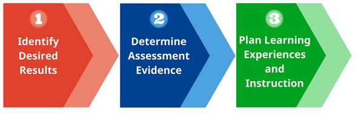

:PROPERTIES:
:ID:       e83eed59-7707-488f-9ba5-9312d9107c3a
:END:
#+title: 從陪聊到動手——AI走進閱讀課
# -*- org-export-babel-evaluate: nil -*-
#+AUTHOR: 臺南一中 顏永進
#+DATE: 2026-05-07
#+SUBTITLE: 115 精進計畫｜高雄市輔導團研習：AI 應用在閱讀輔助力
#+TAGS: AI, Reading, Teaching
#+EXCLUDE_TAGS: noexport
#+OPTIONS: toc:2 ^:nil num:5
#+OPTIONS: H:4
#+LATEX:\newpage
#+HTML_HEAD: <link rel="stylesheet" type="text/css" href="../../../notes/css/muse.css" />
#+HTML_HEAD_EXTRA: 

* 研習資訊

- 日期：2026-05-07（四）
- 主題：AI 應用在閱讀輔助力
- 對象：高雄市國中輔導團
- 講者：臺南一中 顏永進
- 主軸：從陪聊到動手 -_-

* forme: 研習前事前準備                                            :noexport:

** 主要風險：場地網路 NAT 速率限制

學校／公家場地通常多人共用 1 個對外 IP。30 人同時打 Claude.ai 時，Cloudflare 會把這個 IP 當成「異常使用」，部分連線被排隊或擋下——徵兆是 *「同樣輸入，有人跑得出來、有人卡住」* 。
（先前在電腦教室教學生時已驗證過。）

** 30 分鐘前到場——做網路壓力測試

- 連場地 wifi，自己用 Claude 跑一次 Step 1-4 完整流程
- 跑得順 → 照原計畫
- 卡住或慢得不像話 → 啟動下面備案

** 備案：自帶手機熱點

帶手機 ＋ 行動電源。主要 demo 切到熱點（避開學校 NAT），輔導員看示範就好。

** 開場第一句先打預防針

「如果等等你那台跑得慢、卡住沒反應——不是你做錯，是場地網路擠了。先看旁邊的人怎麼跑，等等再補。」

** 別讓 30 人「同時按送出」

- 每個 Step 之間錯開 2-3 分鐘
- 或我 demo 完一段，再讓輔導員分組做

** 帳號／檔案預備

- Claude.ai：研習當天才登入，確保前 5 小時 0 訊息使用（避免額度被早上的事情吃掉）
- NotebookLM、Napkin：同一個 Google 帳號登入
- 教案範本 =兒時記趣教案.docx= 預先下載到桌面，避免現場下載失敗
- 5 份示範產出（research、questions、differentiation、lesson-plan、worksheet）印幾份紙本——網路全壞時至少能講解「目標長什麼樣」

** 備份的備份：本機剪貼簿

把 Step 1、3、4 的 prompt 預先複製到剪貼簿管理工具（macOS 內建有，或裝 Maccy）——萬一講義網頁打不開，還能從剪貼簿叫出來貼

** Token 控制策略（5/4 重新檢討後的核心原則）

實際測試發現免費版 Claude 跑到 Step 3 token 就燒光、出現 "Get Pro" 提示。為了讓免費版能完整跑完，這份講義已採用三個 token-saving 策略：

1. *主題從〈背影〉改成「橋頭糖廠」* ——避免 Claude 反覆 fetch 課文原文（NotebookLM 一次處理完所有素材）
2. *Claude 用兩次但每次聚焦* ——Step 3 學習單一次（簡單）、Step 4 教案一次（複雜）。每次新對話、單一任務，比一次塞太多更穩
3. *每個 Step 開新對話* ——LLM 每次送訊息都要把整段對話歷史重送一次給模型，對話越長、每條訊息越貴。新對話讓 input token 從 0 累積，免費版的 5 小時額度能多撐幾條訊息（注意：5h 訊息額度本身無法重置，只是讓「同樣的額度能跑更多事」）

** 研習當天的 token 急救

如果還是撞牆（出現 "Get Pro" 或 "This response didn't load"），由輕到重四層 fallback：

1. *切換到 Haiku 4.5* ——對話框旁邊的模型選單 → 選 Haiku 4.5。同帳號、同對話、繼續跑。Haiku 對訊息額度的扣抵權重大約是 Sonnet 的 1/3-1/5，所以同樣的 5h 上限可以多撐很多訊息。 *代價*：格式遵循略弱、長文整合略差——對「生簡單教案」夠用，對「嚴格照範本」要警覺。
2. *關掉舊對話、開新對話* ——重新上傳 .docx，從該 Step 重跑（避免繼承過長對話歷史）
3. *退到 Gemini* ——免費 Gemini 2.5 Pro 容量更寬，[[https://gemini.google.com][gemini.google.com]] 用 Google 帳號登入即可，prompt 完全相容
4. *退到複製貼上* ——把素材貼進對話框，比 fetch 省 token

切換順序的精神： *盡量留在原工具* ——切 Haiku 比切對話順、切對話比切 Gemini 順。每多換一層，老師的學習負擔越大。

研習現場若卡住，先喊：「我們先切 Haiku 看看」（最輕）；真的不行再「我們改用 Gemini」（展示 Lv.2 真諦： *工具是可替換的，方法不變* ）。

** forme：給輔導員的回家叮嚀                                       :noexport:

研習結尾要特別講一句：

「我今天 demo 都用 Sonnet 4.6，因為現場我要保證品質。 *但你回家備課，建議直接切 Haiku 4.5* ——對『生教案』這種單純任務，Haiku 已經夠用，而且額度可以撐到 3-4 倍久。Sonnet 留給比較複雜的場合（要嚴格照範本、要多附件整合的時候再切回來）。」

這個策略性建議對輔導員特別實用——他們回去要常用 Claude，知道「什麼任務用什麼模型」比知道單一工具更重要。

* 時間軸

| 時段        | 區塊                          |
|-------------+-------------------------------|
| 09:30–11:00 | 第一部分：實作——從陪聊到動手 |
| 11:00–11:10 | 休息                          |
| 11:10–12:10 | 第二部分：模型、代理人與你    |
| 12:10–12:30 | 綜合座談                      |

* 今天要做什麼？

- PART #1：很多人以為 AI 就是「幫你出個題目、改一篇作文」，但真正能解放老師的用法，是「讓 AI 幫你把整堂課備出來」。
- PART #2：讓 AI 幫你自動生成整份文件只是開始，我們要從這裡出發，讓 AI 開始控制你的電腦，再看看代理人能做到什麼程度。

主題素材： *橋頭糖廠——台灣第一座新式糖廠（1901）*

老師走完一次「AI 輔助備課」流程，產出一份完整教案。今天的主題只是例子——同一套流程可以套到任何閱讀素養單元：〈背影〉、〈兒時記趣〉、左營眷村、美濃水圳……，也可以套用到其他領域。

| 階段 | 你做什麼                                          | 帶走的東西                     |
|------+---------------------------------------------------+--------------------------------|
| 讀   | NotebookLM 讀史料、產研究筆記                     | 研究筆記＋完整參考文獻（Word） |
| 畫   | Napkin 畫兩張視覺化圖                             | 因果關係圖＋時間軸（兩張 PNG） |
| 學   | Claude 生簡單學習單（學生最終要會的事）           | 一份學習單（Word）             |
| 教   | Claude 倒推設計完整教案（以能做完學習單為目標）   | 一份跨領域閱讀教案（Word）     |

跑 4 步，Claude 用兩次但 *每次都聚焦單一任務* ——這是專為免費版 token 額度設計的拆分流程。一小時後，你手上會有：研究筆記、兩張圖、學習單、教案。學習單是學生拿在手上做的，教案是你自己上課用的。

** 為什麼挑「橋頭糖廠」？

- *高雄在地連結最強* ——橋頭糖廠就在高雄市橋頭區（學生搭高捷紅線就到），輔導員回去帶班特別有感
- *直接對應 108 課綱* ——國中歷史八上「日治時期經濟發展」單元。橋頭糖廠是課本主文中常被簡略帶過、但剛好可以作為「閱讀素養延伸個案」的代表
- *跨領域閱讀素材* ——歷史、公民、國文都能用，國文輔導員可拉社會老師共備
- *公開素材豐富* ——維基、台糖官網、地方文史，NotebookLM 餵得進來

* AI 使用的五個層次

| 階段                     | 做法                              | 代表工具                                      |
|--------------------------+-----------------------------------+-----------------------------------------------|
| Lv.1 問答機              | prompt → copy → paste             | ChatGPT 網頁版                                |
| Lv.2 整合工作流          | 串接各種AI服務的優勢              | NotebookLM + Napkin + Claude / Gemini + Gamma |
| Lv.3 初級助理            | AI 自己規劃步驟、操作電腦完成任務 | Claude Code、Gemini CLI                       |
| Lv.4 進階助理            | 你規劃步驟，AI 操作電腦           | Claude Code 客製 Skill、n8n                   |
| Lv.5 專屬助理            | AI 規劃步驟＋操作電腦             | OpenClaw、Hermes                              |

** forme :noexport:
- 大部分老師卡在 Lv.1，所以備課寫到死還是覺得自己在「打字工」，頂多升級到排版工人。
- 今天直接帶你走到 Lv.4——你要學的不是某一個工具，是「怎麼把 AI 編進備課流程」。
- 有時間的話可以示範一下 Lv. 5

* PART #1：實作1——從陪聊到動手（9:30–11:00）

** 這三年 AI 升級了什麼

- 2023：會聊天（ChatGPT 爆紅）
- 2024：住進工具裡（NotebookLM、Gemini in Workspace、Copilot）
- 2025：會動手（Claude Code、Gemini CLI、Atlas 瀏覽器）
- 2026：被訓成你的專屬助理（Skills、MCP）、主動幫你完成一些例行性工作

** PART #1目標

- 從「AI 是個工具」升級到「AI 可以幫我完成一整套流程」
- 今天的課文只是一個例子，同一種方法你可以應用到不同領域、科目，生成不同內容

** 方法：逆向設計（Backward Design）

我們今天跑的流程，其實是一個老師熟的方法： *逆向設計* ——Wiggins & McTighe 在 *Understanding by Design* (1998) 提出的三階段教案設計法。

我不是先列「AI 工具有哪些」再帶你們玩。我是 *先決定「學生上完這堂課要會什麼」，再倒推每一步*：

- 學生最終要會的事 = *做完一份學習單* （Step 3 的產出）
- 要產出學習單 → 前面要有研究筆記（題目從哪來）
- 要有完整教案 → 前面要先有學習單（教案的目標就是「讓學生做完這份」）
- 要有教案的視覺輔助 → 前面要有兩張圖
- 要有研究筆記與兩張圖 → 前面要有對的素材清單

從終點往回排—— *AI 不是替你決定要去哪，是你決定了之後，AI 替你跑完路線。*

這就是 UbD 的核心：「學習單」是 Stage 1（學生要展現什麼能力）、「教案」是 Stage 3（怎麼教學生達到那個能力）。先有 1 才有 3。

*** forme: 引 UbD 的時機                                          :noexport:

- 不要一開始就丟「Backward Design」這個詞——先讓老師跑完流程，產生「咦，這個架構好像很熟」的感覺，再點破
- 點破後可以補一句：「跟你們在做素養導向教學設計時用的概念一模一樣，今天只是把這個思考方式套進跟 AI 對話」
- 這個錨能把「AI 流程」跟老師既有的「教學設計專業」接起來——他們不是在學新東西，是在用熟方法操新工具

** Step 1：NotebookLM——讀懂課文＋產出研究筆記

*** 先看 Lv.1 的限制

打開 [[https://chatgpt.com][ChatGPT]]，直接問：

#+begin_example
請介紹橋頭糖廠的歷史與重要性。
#+end_example

ChatGPT 會給你一個流暢的答案，但：

- 多半只講「台灣第一座新式糖廠」的觀光導覽版，不會主動提到甘蔗農剝削、二林事件這條線
- 「為什麼選橋仔頭設廠」背後的水源／鐵道／交通條件可能寫錯
- 沒有出處——你不知道哪一句可以寫進備課單
- 想拿來教「閱讀素養」中的「省思評鑑」層次，這份答案根本不夠用

這就是 Lv.1 的極限。接下來換 Lv.2 的方式。

*** 上傳素材到 NotebookLM

打開 [[https://notebooklm.google.com][NotebookLM]]（用 Google 帳號登入），把以下五個網址直接 *貼* 到「來源」欄位（NotebookLM 會自動抓網頁內容）：

1. [[https://zh.wikipedia.org/zh-tw/%E6%A9%8B%E9%A0%AD%E7%B3%96%E5%BB%A0][橋頭糖廠——維基百科]]
2. [[https://www.taisugar.com.tw/chinese/Attractions_detail.aspx?n=10048&s=2&p=0][橋頭糖廠——台糖官網（觀光園區介紹）]]
3. [[https://vocus.cc/article/647fdfe7fd89780001d36f1b][臺灣糖業的源起之地——橋頭糖廠時空巡禮（方格子）]]——*本場研習的關鍵素材*
4. [[https://vocus.cc/article/5d184221fd89780001f98ba1][糖業王國興衰路——橋頭糖廠（方格子）]]——產業變遷視角
5. [[http://map.net.tw/taisugar/item/%E6%A9%8B%E9%A0%AD%E7%B3%96%E5%BB%A0/][橋頭糖廠——台灣製糖工廠百年文史地圖]]

更多素材見底下「素材清單」。

📌 *網址 vs PDF 的差別* （給認真想拼品質的老師看）：

| 來源型態   | NotebookLM 解析品質                                               | 操作成本                          |
|------------+-------------------------------------------------------------------+-----------------------------------|
| 直接貼網址 | 中：會把網頁的 navbar、廣告、相關文章等雜訊一併抓進來，內容被稀釋 | 低（一鍵貼）                      |
| 上傳 PDF   | 高：只抓文字主體，引用更準、quote 更乾淨                          | 高（每篇要先「列印 → 另存 PDF」） |

研習當天我們走「貼網址」省事；如果你回家想為某個重要單元拼到極致，把網頁先存 PDF 再上傳，NotebookLM 給的內容深度會明顯不同。

*** 換別的課文/領域怎麼找素材？

研習當天我幫你準備好橋頭糖廠的清單，但回家備別的主題或課文時你得自己找。三招：

**第 1 招：用 NotebookLM 內建的「探索」（在網路上搜尋新來源/Discover sources）**

進入 NotebookLM → 新增筆記本 → 點 *「Discover sources」* → 輸入主題 → NotebookLM 自動建議 10 份網路素材，一鍵加入。最省時的方法。

**第 2 招：請 AI 開一份「分層素材清單」**

打開 [[https://chatgpt.com][ChatGPT]] 或 [[https://gemini.google.com][Gemini]]，貼這段 prompt：

#+begin_example
我要為國中生上 XX 這個閱讀素養主題，準備寫一份完整教案。請給我 10 份網路上能找到的素材清單，分三類：

一、權威來源（維基百科、教育部、學術論文、文學館資料庫）
二、教師社群分享（教學案例、共備講義、評析文章）
三、批判閱讀對照組（媒體報導、部落格、聳動標題、爭議觀點）

每份附上完整 URL 與一句話介紹。
#+end_example

第三類「批判閱讀對照組」特別值得花心思——它就是課堂上「文宣表面 vs 史料真相」的對照素材。例如橋頭糖廠的旅遊文宣寫「百年糖業文化」，史料寫「甘蔗農抗爭」，這兩種敘述的落差就是這類。

**第 3 招：AI 找的素材一定要逐個點開驗證**

- AI 會幻覺出 *根本不存在的網址*
- AI 會把不同文章的內容混搭成「假摘要」
- 看清楚： *誰寫的、什麼時候寫的、立場是什麼*

點不開的丟掉、來源可疑的丟掉。剩下的才上傳到 NotebookLM。

*** forme: 找素材講話順序  :noexport:

1. 先示範手動 Google：「來，先看一下我之前都怎麼找的」——快 Google「橋頭糖廠 教學」、滑了 2 頁、表情糾結。 *製造痛點。*
2. 切到 ChatGPT 貼分層 prompt → 10 條清單立刻出來 → 讓老師「咦」一下
3. 切到 NotebookLM Discover sources → 自動建議＋一鍵加入 → 讓老師「哇」一下
4. 強調： *三招不是擇一，是疊加用*
   - NotebookLM Discover：8 成的找素材時間用這招
   - ChatGPT 分層清單：補強「批判閱讀對照組」
   - 手動 Google：找特定教師社群分享（openclass 之類）
5. 收束句：「你以後備課的『找資料』不再是時間黑洞。」

*** 依序問四個問題

**** 第 1 問（大方向）

#+begin_example
根據這些資料，日本人為什麼在 1901 年選擇橋仔頭設立台灣第一座新式糖廠？背後有哪些關鍵的時代背景？
#+end_example

**** 第 2 問（追細節）

#+begin_example
橋頭糖廠選址橋仔頭的具體條件是什麼（水源、交通、地理、政策）？請引用史料說明。
#+end_example

**** 第 3 問（文宣 vs 史料——本場核心）

#+begin_example
觀光導覽／旅遊文宣多半把橋頭糖廠寫成「百年糖業文化」、「五分車記憶」這類懷舊風，但同時期的甘蔗農生計、剝削問題、二林事件之類的史料寫的是另一回事。這兩種敘述的落差是什麼？該怎麼跟學生討論？
#+end_example

**** 第 4 問（教學切入）

#+begin_example
如果我要為國中生設計閱讀三層次提問（事實／推論／評價），這個主題各層次可以怎麼問？請每層各給三題，並標示出處段落。
#+end_example

*** 請 NotebookLM 幫你打包

問完之後，貼這段指令讓它整合：

#+begin_example
請把我們剛才所有對話整合成一份「主題研究筆記」，這份筆記接下來要餵給 Claude 寫教案。格式如下：

一、主題基本資訊：題目、年代範圍、地理位置

二、關鍵史實：列出所有重要事實。每個事實點必須：
  (a) *直接引用原文一段* （用「」標出，至少 15 字）
  (b) 後面標來源編號 [X]
  (c) 不能引出原文的事實，整個不要列——寧可少寫，不要編造

  範例格式：
  「1901 年 2 月 15 日，臺灣製糖株式會社開始於臺南廳橋仔頭建廠。」[1]

三、分類整理：自然條件、政策背景、企業考量、戰略需求等
四、文宣表面 vs 史料真相：旅遊文宣與真實史料的落差，這是教案中的批判閱讀切入點。兩種敘述各引原文一段
五、教學提問素材：三層次題組初稿（事實層／推論層／評價層各 3 題，每題附對應原文段落）
六、 *完整參考文獻清單* ：列出每一份資料的作者、文章名稱、出處、網址，按編號排列；之後 Claude 寫教案時要直接引用

七、 *視覺化用條列* （之後要直接貼給 Napkin 畫圖用，請寫成乾淨的條列）：

  (甲) 選址原因因果關係圖（5-6 條）：
       例如：「自然條件：水源充足（中崎溪）、氣候適合甘蔗、地勢平坦」
       涵蓋面向：自然條件／交通條件／政策推動／企業考量／戰略需求

  (乙) 橋頭糖廠時間軸（5-8 個節點）：
       例如：「1901 台灣製糖株式會社成立，選定橋仔頭設廠」
       涵蓋從建廠（1901）到現在（轉型文化園區）的關鍵事件
#+end_example

⚠️ *為什麼第二條那樣寫* ——NotebookLM 的出處編號偶爾會錯亂（編號跳號、不同編號指到同一來源、或編號跟內容對不上）。 *強迫它「引用原文」* 是預防錯亂最有效的方法：模型必須真的回去看 chunk，編號才能對得起來。

⚠️ *第 5、6、7 條特別重要* ：

- 第 5 條讓 Claude 不用自己重新出題（省 token、品質穩）
- 第 6 條讓 Claude 不用編造引用文獻
- 第 7 條讓 Step 2 Napkin 直接複製貼上、不用老師再從研究筆記裡抓重點

少了任一條，後面的 Step 都會變糊或變麻煩。

*** 萬一 NotebookLM 的編號還是錯了——三層補救

即使有了預防 prompt，編號仍可能少數錯亂。由輕到重：

1. *追加引述要求*：貼下面這段叫它重做

   #+begin_example
   請逐一核對你剛才產出的研究筆記中所有的出處編號 [X]。
   針對每一個事實點，回去檢查標註的來源是否真的包含那段引言。
   錯的編號改正、找不到對應原文的事實整個刪除（寧可少寫不要編）。
   重新輸出修正後的研究筆記。
   #+end_example

2. *自我核對表*：要它列出對照表

   #+begin_example
   請列出剛才研究筆記中所有出處引用，格式：
   | 事實點 | 標註來源 [X] | 該來源實際是否提到此事實 | 結論（保留/刪除/改成 [Y]）|
   核對完，重新輸出修正後的研究筆記。
   #+end_example

3. *核武器：重開筆記本* ——把對話關掉、新建 notebook、重新上傳素材、重貼 4 問與打包指令。LLM 的隨機性這次反而幫你修錯。代價：之前的追問脈絡消失。

*** 匯出成 Word 檔

操作步驟：

1. 在回答下方點「儲存到記事」
2. 到「工作室」找到記事 → 點「匯出至文件」→ 拿到 .docx

*** 老師的把關時間——人工檢視研究筆記

打開剛才匯出的 .docx，花 5-10 分鐘做三件事:

| 動作                 | 為什麼要做                                                                                                                                    |
|----------------------+-----------------------------------------------------------------------------------------------------------------------------------------------|
| *讀一遍，刪掉錯的*   | NotebookLM 雖然有出處標註，但仍可能抄錯年代、人名、地名——你身為老師，知道哪些細節怪                                                           |
| *核對出處編號是否對* | NotebookLM 的 source attribution 偶爾會錯亂：編號跳號、不同編號指到同一來源、編號跟內容對不上。逐一點開編號驗證，錯的直接改                   |
| *砍掉重複、冗餘*     | 來源彼此重疊時，NotebookLM 會把同一件事講三次。挑最完整的留、其他刪——*這也直接省下 Step 3、4 的 Claude token*                                 |
| *補上你自己的判斷*   | NotebookLM 給的是「資料整合」，不是「教學判斷」。在筆記中加幾句「↑這段適合放教材分析」「↑這段太硬，國中生看不懂」這類旁註，後面 Claude 會看到 |

- AI 的強項是 *整合分析資料* ，不是 *判斷教學適切性* ——後者只有老師會
- 後面 Claude 寫教案時會把研究筆記內容直接抄進去，*你刪掉的，學生才不會看到*
- *出處編號錯的話特別嚴重* ——Claude 會把錯誤的編號排進教案的「參考文獻」段，學生／審查委員一查就翻車

⚠️ *如果出處編號錯太多，重新打包一次*：回到 NotebookLM 對話框，貼一樣的「打包指令」再跑一次。NotebookLM 重新生成時，編號通常會修正（這是 LLM 的隨機性反而幫你修錯）。

完成檢視後，存檔（建議命名 =research-notes-reviewed.docx= ）。 *這個檔案才是* 接下來兩步的素材庫——它會直接餵進 Step 3 與 Step 4 的 Claude。

** 課程設計邏輯: Ubd
以下的課程設計採用UbD (Understanding by Design/重理解的課程設計)的方式，UbD也稱「逆向設計/Backward Design」，是由 Grant Wiggins 與 Jay McTighe 於 1998 年提出的教學設計框架。其核心理念是「以終為始」(Begin with the end in mind)，主張在規畫具體的教學活動前，必須先明確定義學習者最終應達成的「理解」與「成效」。
#+CAPTION: UbD 的三個階段
#+LABEL:fig:Labl
#+name: fig:Name
#+ATTR_LATEX: :width 300
#+ATTR_ORG: :width 300
#+ATTR_HTML: :width 500

** Step 2：Napkin——畫兩張視覺化圖

Napkin 是 *用文字 prompt 一鍵生視覺化* 的工具——你給它一段條列文字，它生流程圖、矩陣、樹狀圖給你選。*

*** 教案中的視覺化邏輯：

- *圖 1（因果關係圖）* ：回答「為什麼」——選橋仔頭的多重原因
- *圖 2（時間軸）* ：回答「然後呢」——從 1901 到現在的演變

*** 操作流程

打開 [[https://napkin.ai][Napkin]]（用 Google 帳號免費登入）。

📌 *素材在哪裡* ：打開 Step 1 的 =research-notes-reviewed.docx= ，找到 *第七節「視覺化用條列」* ——NotebookLM 已經幫你寫好兩段條列，分別對應兩張圖。直接複製貼到 Napkin 就好。

**圖 1：選址原因因果關係圖**

從研究筆記第七節 (甲) 複製整段選址原因條列 → 新建 Napkin 文件 → 貼上 → Napkin 自動生成多種視覺化方案 → 挑「因果／放射狀」風格 → 下載 PNG（命名 =fig1-causes.png= ）

**圖 2：橋頭糖廠時間軸**

從研究筆記第七節 (乙) 複製整段時間軸條列 → 新建 Napkin 文件 → 貼上 → 挑「時間軸（Timeline）」風格 → 下載 PNG（命名 =fig2-timeline.png= ）

→ 老師手上會有兩張 PNG，待會上傳給 Claude。

⚠️ *如果第七節內容單薄或不對* ——回 Step 1 的「人工檢視時間」補強，或回 NotebookLM 對話框追問：

#+begin_example
請把研究筆記第七節（視覺化用條列）的兩個條列補完整：
(甲) 選址原因要涵蓋自然/交通/政策/企業/戰略 5 個面向，每點要有具體細節
(乙) 時間軸要從建廠到現在，至少 6 個關鍵節點，含年代與事件
#+end_example

** Step 3：Claude——生簡單學習單（先決定終點）

*場景：在備教案之前，先想清楚「學生最終要做完什麼」。學習單就是答案。*

*** 為什麼學習單先做？

UbD 的精神：先決定「學生要會什麼」，再倒推「教師要教什麼」。

如果先寫教案、後做學習單，常出現的問題是：教案寫得很漂亮、流程很豐富，但回頭做學習單時發現「咦，這些活動跟學習單對不上」——只好兩邊互相妥協。

倒過來做：先讓 Claude 產出一份簡單的學習單，再以「能讓學生完成這份」為目標生教案，邏輯一致、活動聚焦。

*** 操作流程

*建議開新對話* ——這是 Claude 第一次出場，給它乾淨的脈絡。

老師上傳一個檔案：

1. *Step 1 的研究筆記* =research-notes-reviewed.docx=

#+begin_example
請根據附件研究筆記，為「橋頭糖廠」這個閱讀素養主題設計一份簡單的學習單，輸出為 Word 檔（.docx）。

【學習單結構】（A4 雙面內，不要太長）
1. 抬頭：班級／座號／姓名／日期填寫格
2. 暖身題（1 題）：連結學生生命經驗的開放題（例：「你經過過糖廠／類似的舊工業區嗎？當時的感覺？」）
3. 精讀題（5 題）：直接從研究筆記中的三層次題組挑選，事實層 2 題、推論層 2 題、評價層 1 題，每題下方留 3-4 行空白
4. 小組討論題（1 題）：「文宣表面 vs 史料真相」對照題，留半頁空白
5. 學完寫一寫（1 題）：給能力較強的學生延伸寫作，例：「你會怎麼跟外地朋友介紹橋頭糖廠？」

【格式要求】
- 字級不小於 12pt、行距 1.5、學生看得清楚
- 全部留學生填寫的空白格／橫線
- 對象國中生（13-15 歲），用語要貼近這個年齡
- 不要分能力版本，一份就好

完成後請在回答開頭簡述「我從研究筆記挑了哪 5 題進精讀題」，方便老師驗收。
#+end_example

5 分鐘後 → Claude 產出 Artifact → 下載 =worksheet.docx=

*** 帶走的觀念

- 學習單是「學生最終要會什麼」的具體呈現——比抽象的「學習目標」更具體
- 學習單做完，下一步教案的「教學流程」就有清楚的目標：每個活動都要對應到學習單某一段
- AI 5 秒做好排版、留白、橫線——老師最花時間的部分被消化掉了

** Step 4：Claude——倒推設計完整教案（壓軸）

*場景：學習單已經有了（學生最終要做完的東西）。現在請 Claude 倒推設計教案：教學流程的每一步，都要對應到學習單的某一段。*

*** 這是研習的最強展示

同一個 prompt，Claude 同時做四件事——

1. 讀學習單，反推「學生要會什麼」
2. 抽取教案範本的格式結構
3. 設計教學流程——每個活動對應到學習單的某個段
4. 把上傳的兩張 PNG *直接嵌進 docx 對應段落*

整個過程 *零人工介入* ——示範時就講這句話：「我按下送出，下次再碰電腦的時候，已經是下載完成的教案 .docx 了，而且每個活動都跟學習單對得起來。」這就是 Lv.3 + UbD 的真貌。

*** 操作流程

*建議開新對話* ——避免繼承 Step 3 的對話歷史，token 從 0 累積。

老師上傳四個檔案：

1. *Step 1 的研究筆記* =research-notes-reviewed.docx=
2. *Step 2 的兩張圖* =fig1-causes.png= 與 =fig2-timeline.png=
3. *Step 3 的學習單* =worksheet.docx=
4. *教案格式範本*：[[https://openclass.kl.edu.tw/plan/file/1738/%E5%85%92%E6%99%82%E8%A8%98%E8%B6%A3%E6%95%99%E6%A1%88.docx][基隆市 openclass〈兒時記趣〉教案 (.docx)]]（先下載到桌面）

📌 *Claude 免費版會把 PNG 嵌進 docx* ——產出 Artifact 時自動把上傳圖檔打包進 docx 的 =word/media/= 裡，並在指定段落嵌入。老師下載後直接打開就能看到完整圖文整合的教案。

#+begin_example
請整合附件素材，為「橋頭糖廠」這個跨領域閱讀素材產出一份完整教案，輸出為 Word 檔（.docx）。

【UbD 核心原則——這是這份教案的設計邏輯】
附件中有一份「學習單.docx」，那是學生最終要做完的東西。
請以「能讓學生完成這份學習單」為目標，倒推設計教學流程。
每一個教學活動都要明確對應到學習單的某一段（暖身題／精讀題／小組討論／延伸寫作）。

【格式要求——逐字遵守】
我上傳了一份教案格式範本（〈兒時記趣〉教案），請你：
1. 先打開這份範本，把「結構」抽出來：有哪些欄位、欄位的順序、表格、標題層級、字體大小。
2. 完全照搬這個結構。欄位名稱不要自己改。
3. 範本沒有的欄位（例如跨域延伸、與學習單對應表），補在最後但沿用範本的樣式。
4. 字型：中文用標楷體或新細明體（依範本）、英數用 Times New Roman。
5. 完成後請在回答開頭列出兩件事：(1) 我從範本抽出的結構清單；(2) 教學流程哪一段對應到學習單哪一題。

【內容要求】
基本資訊：
- 主題：橋頭糖廠——台灣第一座新式糖廠（1901）
- 屬性：跨領域閱讀素養素材（國文／歷史／公民）
- 對象：國中（13-15 歲）
- 節數：3 節（共 135 分鐘）

教案需包含：
1. 教學目標（對應 108 課綱閱讀素養指標、對應到學習單預期能力）
2. 教材分析（主題特色、學習難點、文宣表面 vs 史料真相的教學切入）
3. 教學流程（每節分「引起動機 / 發展活動 / 綜合活動」三段，標註時間，每段註明「對應學習單第幾題」）
   *請把附件 fig1-causes.png 嵌入「教材分析」欄位末尾，置中、寬度約 14cm*
   *請把附件 fig2-timeline.png 嵌入「教學流程」欄位最開頭，置中、寬度約 14cm*
4. 提問設計（直接用研究筆記中的三層次題組）
5. 評量方式（形成性 = 學習單填寫狀況；總結性 = 學習單品質）
6. 跨域延伸建議（歷史科：日治糖業與經濟；公民科：在地產業變遷與社會影響）
7. 參考文獻（根據研究筆記中的清單，按編號排列，至少 5 篇）

【嚴格規則】
- 兩張圖 *必須* 嵌入指定段落，不要替我留佔位框
- 教學流程跟學習單必須對得起來，不要兩邊各自漂亮
- 引用的具體事實（年代、人名、地名）必須跟研究筆記一致，不要自己編
- 語氣自然、不要太教條
#+end_example

5-10 分鐘後 → Claude 產出 Artifact → 下載 .docx → 老師打開直接看到完整教案＋兩張圖

*** 下載後的檢查清單

1. 兩張圖是否真的嵌進對應段落？（最容易出包）
2. 教學目標是否真的對應到你的班——AI 寫得很「漂亮」但可能離地
3. 時間分配是否合理——AI 排出來的時間常常不夠，要實際走一遍
4. 評量規準是否真的可評？還是只是好看的形容詞？
5. 引用的具體事實（年代、數字、人名）是否正確？AI 會編
6. 跨域連結——你的學校有沒有可以合作的歷史／公民老師？

*** 帶走的觀念

- *先做學習單再做教案* 是 UbD 的精髓——終點先定，路線才不會走偏
- 一份教案的「正文」AI 能寫，但「教學現場感」要老師補
- 把今天的教案＋兩張圖列印出來，下週直接走
- *對輔導團特別重要* ：你帶回去的不是「我會用 AI」，是「一套可以複製給其他老師的備課流程」

** 本日回顧

| 階段 | 成品                                              |
|------+---------------------------------------------------|
| 讀   | NotebookLM 研究筆記＋完整參考文獻（Word）         |
| 畫   | Napkin 因果關係圖＋時間軸（兩張 PNG）             |
| 學   | Claude 學生用學習單（Word）                       |
| 教   | Claude 跨領域閱讀教案（Word，含內嵌圖、對應學習單）|

Claude 用兩次但 *每次都聚焦單一任務* ——學習單先做（決定終點），教案後做（倒推流程）。這是 UbD 的標準做法，也是 token 友善的設計。

一小時前你還在煩這個跨領域主題怎麼上，現在你下週的課已經備完。回去帶班的延伸價值：
- 跨域共備：可拉歷史、公民老師一起跑同一主題
- 探究學習：教學流程裡的提問題組可以拆出來給學生做小型研究
- 方法傳出去：同一套流程套到〈背影〉、〈兒時記趣〉、左營眷村……都能跑

* 休息（11:00–11:10）

* PART #2：實作與示範——模型、代理人與你（11:10–12:10）

PART #1 我們把整套教案流程跑完了。PART #2 拆三個切面深入：

1. *Section 1（Skill）* :把這套流程「凍結」起來，下次一句話搞定
2. *Section 2（Gemini CLI）* :把 AI 從瀏覽器拉出來、操作你的檔案系統
3. *Section 3（代理人、模型、你）* :抽象拉開——AI 的層級、模型怎麼運作、老師的角色

** Section 1｜把流程凍結成 Skill（Lv.4 代理人）

*場景：今天我們花 90 分鐘做完橋頭糖廠這個主題。下禮拜你要備〈兒時記趣〉、〈麥琪的禮物〉，或者「左營眷村文化」、「美濃水圳」這些跨域主題……每一個都要重新貼今天這幾段 prompt 嗎？*

*** Prompt 是封信，Skill 是 SOP

| Prompt                       | Skill                          |
|------------------------------+--------------------------------|
| 寫一封信，寄完就丟           | 訂一個 SOP，永遠跟著用         |
| 每次重新打                   | 寫一次，AI 一直照做            |
| 你給 AI 一個任務             | 你給 AI 一份「流程說明書」     |
| 「請為橋頭糖廠寫教案」       | 「請用閱讀教案流程處理 X」     |

下次打開 Claude，你只要說一句：

#+begin_example
請用閱讀教案流程，為「左營眷村文化」產出國中跨領域閱讀教案。
研究筆記與兩張圖附後。
#+end_example

然後上傳素材——AI 自己跑完整套整合，產出教案 docx。

*** Demo:現場上傳一個 Skill 看看

📦 *下載連結* :[[https://github.com/letranger/2026-05-07-AI-Reading/raw/main/reading-lesson-pack.zip][reading-lesson-pack.zip]]——研習當天會用，研習後可下載自己裝

1. 開 [[https://claude.ai][claude.ai]] → 右上頭像 → *Customize → Skills* → 點「+ Add Skill」
2. 把上面下載的 =reading-lesson-pack.zip= 拖進去——裡面就是一份 =SKILL.md= ，類似這樣：

#+begin_example
---
name: reading-lesson-pack
description: 為任何閱讀素養主題以 UbD 邏輯生成「學習單＋教案」配對。當使用者上傳「研究筆記＋兩張視覺化圖＋教案格式範本」並要求「跑閱讀教案流程」時觸發。先產學習單（決定終點），再倒推設計教案。
---

# 跨領域閱讀教案產生器（UbD 兩階段）

當被要求產出時，分兩份依序產出:

**第一份:學生用學習單（先做）**
1. 讀研究筆記，抽出三層次題組
2. 設計學習單:暖身題 1、精讀題 5、小組討論 1、延伸寫作 1
3. 留學生填寫的空白格與橫線

**第二份:教師用教案（後做，倒推）**
1. 讀剛才的學習單，反推「學生最終要會什麼」
2. 讀範本，抽出格式結構
3. 設計教學流程，每個活動對應到學習單某一段
4. 把兩張 PNG 嵌入指定段落
5. 從研究筆記抽出參考文獻、按編號列在文末
#+end_example

3. 開新對話，貼一句指令＋上傳素材（研究筆記＋兩張圖＋教案範本），按下送出
4. 等 5-10 分鐘 → 學習單＋教案兩份 docx 連續產出

*** 對比

剛才花 90 分鐘跑完的流程，現在一句話＋一次上傳就搞定。 *這就是 Lv.4。*

*對輔導團特別重要* :你今天傳給其他老師的不再是「我會用 AI」，而是「一份可以複製貼上的流程檔」——這才是「方法傳出去」的真正意思。

*** 紅線提醒

最後一關永遠是你——AI 交成品，掛名的是你。Skill 跑得再快，每一份產出都還是要老師檢查。

** Section 2｜把 AI 從瀏覽器拉出來——Gemini CLI（Lv.3 代理人）

PART #1 跟 Section 1 的所有動作都還關在「網頁」裡——AI 的能力被瀏覽器這個玻璃罩罩住了。

Lv.3 是把玻璃罩拿掉，AI *直接操作你的檔案系統* 。

*** Demo:整理桌面那堆亂七八糟的資料夾

**先下載練習資料夾** :[[https://github.com/letranger/2026-05-07-AI-Reading/raw/main/test-cleanup.zip][test-cleanup.zip]]（50 個模擬檔案：教案、學習單、學生作品、成績、簡報，全部混在一起）

下載後解壓縮到桌面，會看到 =~/Desktop/test-cleanup/= 資料夾。

開終端機：

#+begin_example
cd ~/Desktop/test-cleanup
gemini
#+end_example

啟動 Gemini CLI（裝法見[[*附錄：Gemini CLI 安裝（給研習後想自己玩的人）][附錄]]）後，丟一句中文：

#+begin_example
桌面這堆檔案太亂了。請幫我:
1. 看一下有哪些檔案，按主題（教學素材／研習／學生作品／私人雜項）分類
2. 為每一類建一個子資料夾、把檔案移進去
3. 給每個資料夾用 macOS Finder 標籤上不同顏色
   （請用 `tag -s <顏色> <資料夾>` 命令，-s 表示「替換」而非「附加」，避免標籤疊加）
   建議顏色:教學素材→Blue、研習→Green、學生作品→Yellow、私人雜項→Gray
4. 完成後給我一份「整理報告」（有哪些檔案動了、放哪了、上了什麼顏色）
#+end_example

按 Enter 後，現場看 Gemini CLI 自己跑：

- 讀目錄、列檔案 → 「我看到桌面有 47 個檔案、3 個資料夾」
- 分析檔名、分類 → 「我建議分成：教學素材、研習筆記、學生作品、雜項」
- 每一步問你 =Y/N= 才動手 → 你按確認，它建檔、移動、上色
- 完成後給報告 → 「47 個檔案分入 4 個資料夾，已上色」

90 秒後，桌面乾淨。

*** 重點不是「整理桌面」這件小事

是「AI 出了瀏覽器、進入你的檔案系統」這個門檻。

跨過這道門，所有「在電腦上重複做的雜事」都能交給 AI:
- 備課素材按單元歸檔
- 班級照片批次改名（=20260507_班級活動_001.jpg=）
- 學生繳交檔案統計、缺交清單
- 會議錄音批次轉文字
- ……

*** 紅線

- 第一次玩，先在 *不重要的資料夾* 試手感（別直接拿桌面開刀，萬一翻車很慘）
- Gemini CLI 每一步動手前都會問你 =Y/N= ，看清楚再按
- 重要檔案永遠要先備份

*** forme: Lv.3 demo 的講話順序                                    :noexport:

1. 開場：「Section 1 跟 PART #1 我們做的事都還在瀏覽器裡。瀏覽器是 AI 的玻璃罩，它再聰明都離不開這個框」
2. 把終端機放大字級到看得清楚（事前先設好），cd 到桌面
3. 「現在我把玻璃罩拿掉」——按下 enter 跑 Gemini CLI
4. 慢慢念那段中文 prompt，讓老師看到「這不是程式語言，是中文」
5. 跑起來時邊解說：每一步它要 =Y/N= ，這就是「AI 在問你的同意」——它不會偷偷做
6. 結束後一句：「桌面整理只是個 90 秒的小例子。重點是：你的電腦上所有重複的雜事，都可以這樣交辦。」

** Section 3｜代理人、模型、你

到目前為止你已經看過 Lv.4（Skill）跟 Lv.3（Gemini CLI）兩個具體例子。最後拉開講三件事：整體階梯、AI 怎麼運作、你的角色。

*** 代理人：升級階梯總覽

| Lv | 你做什麼                                   | 對應今天看到的           |
|----+--------------------------------------------+--------------------------|
|  1 | 你會打 prompt                              | ChatGPT 那段「先看 Lv.1 的限制」 |
|  2 | 你會把 NotebookLM、Claude、Napkin 串起來用 | PART #1 的整套四步流程   |
|  3 | AI 替你跑完整個流程（一句話、多步動作）    | Section 2 Gemini CLI demo |
|  4 | 你訂的規則，AI 一直照做（Skill）           | Section 1 上傳 SKILL.zip |
|  5 | AI 規劃步驟＋操作電腦                      | （點到為止，OpenClaw 之類） |

每一層上去，「老師打字的時間」變少，「老師決定方向的時間」變多。Lv.5 是天花板：你只負責決定要去哪，AI 全部包辦。

*** AI Agent——具體例子

代理人不只是「替你跑備課流程」——它可以「替你經營一個身份」、甚至「替你過一整天」。

**** 自立自強的 AI 小編

「推理解剖室」是一個由 AI 自動經營的網站＋ Facebook 粉絲頁。AI 每天自動找推理懸案、寫分析文、排版發到網頁、同步轉發到 FB。創建者只負責「給方向」，AI 負責執行。

- [[https://murderresearch.github.io/Detective-Analysis][推理解剖室（網頁）]]
- [[https://www.facebook.com/profile.php?id=61572157565480][推理解剖室（Facebook 粉絲頁）]]

對老師的啟發：班級網誌、共讀心得、學生作品集——這些「需要長期更新」的東西，未來可以交給 AI 代理人代管。

**** 隨身助理

更激進的代理人——直接接管你的電腦螢幕、鍵盤、滑鼠：

- [[https://openclaw.ai/][OpenClaw]] （龍蝦）：個人桌面 agent 平台，AI 看你的螢幕、操作鍵盤滑鼠
- [[https://github.com/nousresearch/hermes-agent][Hermes]] （愛馬仕）：開源的 agent 框架，可自架、自己接 API

兩個都還在早期、不適合大多數老師現在用——但代表 Lv.5 的方向： *「你下指令、AI 自己處理一整天的雜務」* 。

*** 什麼是 Agent

簡化的對比：

- *人 ↔ 模型* ：你跟 AI 對話、AI 給回答。每一輪都靠 *你* 下指令、推進步驟、判斷下一步要問什麼。這是 PART #1 跟 Section 1 的工作模式。
- *人 ↔ 代理人 ↔ 模型* ：你跟「代理人」講目標，代理人自己決定 *要叫模型做什麼／要不要操作電腦／要不要查網路* 。你只看最終結果。這是 Section 2 的 Gemini CLI、上面 AI Agent 段的例子。

關鍵差別在「誰在規劃步驟」：

| 層級    | 步驟由誰規劃                | 對應今天看到的     |
|---------+-----------------------------+--------------------|
| Lv.1-2  | 人（你每一步都要下指令）    | PART #1            |
| Lv.3-4  | 人預先寫好（prompt 或 Skill），代理人照做 | Section 1（Skill）／ Section 2（Gemini CLI） |
| Lv.5    | 代理人臨場決定              | 推理解剖室、OpenClaw |

*** 模型都要錢嗎

**** 收費模型（商用主流）

主流的「商用模型」都收費，但全部都有 *免費版入門門檻*：

- *Anthropic Claude* ：Sonnet 4.6、Haiku 4.5、Opus 4.7
- *OpenAI GPT* ：GPT-5、GPT-5o
- *Google Gemini* ：Gemini 2.5 Pro、Flash

**** 收費方式

| 方式              | 對誰              | 計算方式                      |
|-------------------+-------------------+-------------------------------|
| 訂閱（網頁／App） | 老師日常用        | 月繳，例如 Claude Pro $20/月  |
| API（按 token）   | 開發者、批次任務  | 按 input + output token 計算  |

研習當天我們走「免費網頁版」——大多數老師回家也夠用。

**** 開放模型（免費／本機）

開源／本地端的免費替代（西方陣營，避開中國模型的資安疑慮）：

- *Meta Llama 系列* ：最廣泛的開源模型，覆蓋從輕量到大型各種規格
- *Google Gemma 系列* （目前最新 Gemma 4）：Google 開源、跟 Gemini 同源，輕量版可在筆電本機跑
- *Mistral / Mixtral 系列* （法國／歐盟）：歐洲開源代表
- *Microsoft Phi 系列* ：微軟的小型高效模型，特別適合舊筆電

這些可以用兩種方式跑：

- [[https://ollama.com][Ollama]] ：本機跑（資料零外流）——對國中老師意義最大，學生作文、輔導紀錄、 IEP 這類敏感資料餵本機模型不會離開你筆電
- [[https://openrouter.ai][OpenRouter]] 等聚合服務：便宜呼叫 API（適合批次任務）

*** 怎麼選模型

以 Anthropic Claude 系列為例（其他家邏輯類似）：

| 模型             | 強項                  | 用在                            | 訊息額度成本   |
|------------------+-----------------------+---------------------------------+----------------|
| Claude Opus 4.7  | 最強推理、最貴        | 複雜分析、需要深度思考的任務    | 高（5x Sonnet）|
| Claude Sonnet 4.6| 平衡品質與速度        | 日常複雜任務、要嚴格照範本      | 中（基準）     |
| Claude Haiku 4.5 | 快、便宜              | 單純任務、聊天、快速產出        | 低（1/3 Sonnet）|

對應今天的流程：

- *Step 4 教案* （複雜、要嚴格照範本、要嵌圖）：建議 Sonnet 4.6
- *Step 3 學習單* （單純、結構簡單）：Haiku 4.5 就夠
- *跟 NotebookLM 對話*（出題、追問）：模型由 Google 端決定，不用選

選模型的判準： *「越複雜的任務、越要照格式的任務」用 Sonnet 以上；「單純文字產出」用 Haiku* 。

*** 模型｜AI 怎麼辦到的（30 秒講完）

AI 不是查資料庫、不是「知道事實」。它的本質是 *猜下一個字* :

- *函數視角* :輸入文字 → 模型計算 → 輸出最可能的下一段文字。沒有「記憶」，每次對話歷史都要重送一次（這就是為什麼新對話省 token）
- *Token 視角* :模型把文字切成「token」處理。中文一字約 1.5-2 token；英文一字約 0.5-1 token。長文成本飆得快
- *幻覺的本質* :因為模型在「猜」、不在「記」，所以它寫得很像那回事的東西可能整個不存在——這就是為什麼 NotebookLM 的編號會錯、Claude 寫的人名年代要核對

*三個推論* :

1. AI 越「肯定」越要警覺——它不會說「我不確定」，會直接給你錯誤答案
2. 凡有標準答案的學科，AI 產出 *必須* 老師最後把關
3. 「為什麼 NotebookLM 跟 Claude 在不同地方都會出包」 = 它們本質都是「會猜下一字的函數」

*** 你｜什麼東西不該丟雲端？

學生作文、輔導紀錄、IEP、未公開競賽作品——一個判準：

*「這段如果被截圖貼到網路上，我會崩潰嗎？」* 會 → 別丟雲端。

進階解法（點到為止）：本機 AI（ollama + 開源模型）跑在你筆電上，資料完全不外流。下次研習可以再深入。

*** 三個帶走的觀念

1. *AI 幫你加速，不是幫你代教* ——上課的還是你
2. *你給 AI 多少「你的樣子」，它就回給你多少「你的樣子」* ——你的教學風格、你的班、你的判斷，要寫進 prompt（或寫進 Skill）
3. *一定要自己檢查* ——尤其是引用、題目、史實——AI 會編

* 綜合座談（12:10–12:30）

Q&A

* 示範作品——跑完流程做出來長這樣

研習當天提供（預計包含）：

- 橋頭糖廠研究筆記.docx（Step 1 NotebookLM 匯出，含完整參考文獻）
- fig1-causes.png（Step 2 Napkin 因果關係圖）
- fig2-timeline.png（Step 2 Napkin 時間軸）
- 橋頭糖廠學習單.docx（Step 3 Claude 學生用學習單）
- 橋頭糖廠跨領域閱讀教案.docx（Step 4 Claude 倒推設計，含內嵌兩張圖、對應學習單、含參考文獻）
- *reading-lesson-pack.zip*——把整套流程凍結成 Skill，回家可以直接上傳到 Claude 用

* 素材清單——上傳到 NotebookLM

點開連結 → 瀏覽器 =Ctrl+P=（Mac =⌘+P=）→「儲存為 PDF」→ 上傳到 NotebookLM。

** 主要素材（建議都上傳）

1. [[https://zh.wikipedia.org/zh-tw/%E6%A9%8B%E9%A0%AD%E7%B3%96%E5%BB%A0][橋頭糖廠——維基百科]]
2. [[https://www.taisugar.com.tw/chinese/Attractions_detail.aspx?n=10048&s=2&p=0][橋頭糖廠——台糖官網（觀光園區介紹）]]
3. [[https://vocus.cc/article/647fdfe7fd89780001d36f1b][臺灣糖業的源起之地——橋頭糖廠時空巡禮（方格子）]]
4. [[https://vocus.cc/article/5d184221fd89780001f98ba1][糖業王國興衰路——橋頭糖廠（方格子）]]
5. [[http://map.net.tw/taisugar/item/%E6%A9%8B%E9%A0%AD%E7%B3%96%E5%BB%A0/][橋頭糖廠——台灣製糖工廠百年文史地圖]]

** 更多素材（有興趣再加）

6. [[https://khh.travel/zh-tw/attractions/detail/211/][橋頭糖廠（台灣糖業博物館）——高雄旅遊網]]——觀光導覽視角，可當「文宣 vs 史料」對照組
7. [[https://ctc.kcg.gov.tw/cp.aspx?n=7CDBAEE0D278E5B1][台糖文化——高雄市橋頭區公所]]——在地觀點
8. 二林事件、林本源製糖會社相關史料——可在台灣大百科、國家文化記憶庫找

* 工具準備清單

| 工具                | 費用             | 帳號準備           |
|---------------------+------------------+--------------------|
| NotebookLM          | 免費             | Google 帳號        |
| Claude（網頁／App） | 免費版夠用       | Anthropic 帳號     |
| Claude Code（加分） | 需訂閱           | 研習後再評估即可   |
| Gemini CLI（加分）  | 免費（API Key）  | Google AI Studio   |

* 附錄：Gemini CLI 安裝（給研習後想自己玩的人）

研習當天我會用我自己預裝好的 Gemini CLI 做 demo（PART #2 的 Lv.3 整理資料夾那段）。如果你回家想自己跑類似的工作，下面是最低門檻的安裝步驟。整套安裝約 5-10 分鐘。

** 1. 裝 Node.js（如果還沒有）

打開 macOS 終端機（=Cmd+空白鍵= → 輸入「終端機」）：

#+begin_example
# 用 Homebrew 裝（推薦）
brew install node

# 或從官網下載 LTS 版本：https://nodejs.org
#+end_example

確認安裝成功：=node --version= 應該回傳 =v20.x.x= 或更新版本。

** 2. 裝 Gemini CLI

#+begin_example
npm install -g @google/gemini-cli
#+end_example

** 3. 領免費 API key

到 [[https://aistudio.google.com/app/apikey][Google AI Studio]] 用 Google 帳號登入 → 點「Create API Key」→ 複製出來。

額度：每分鐘 60 次、每天 1000 次。 *不用信用卡* （不像 Claude Code 要訂閱）。一般教師日常用法碰不到上限。

** 4. 第一次啟動

回到終端機：

#+begin_example
gemini
#+end_example

第一次跑會問你登入方式，貼上 API key 即可。之後 =gemini= 一句就啟動。

** 5. 給 Lv.3 demo 用：裝 =tag= 命令（讓 AI 能操作 Finder 標籤顏色）

#+begin_example
brew install tag
#+end_example

這樣 Gemini 跑「整理資料夾並上色」時，會自動呼叫 =tag -a Red FolderName= 這類命令給 Finder 標籤上色。沒裝 =tag= 的話，AI 就只會建資料夾、移檔案，不會上色。

** 第一次玩的安全建議

- *不要直接在桌面開刀* ——先建一個測試資料夾，丟幾個假檔案進去練手感
- *看每一步的輸出* ——Gemini CLI 動寫入（建檔、移檔、改名、上色）之前都會問你 =Y/N= ，看清楚再按
- *重要檔案永遠先備份* ——任何 AI 工具都一樣的鐵律

* 參考資料

- [[https://www.youtube.com/watch?v=b8ZmokNWjw0][Anthropic 推出的 Skills，為什麼 OpenAI、Google 全部都跟進了？]]
- [[https://www.youtube.com/watch?v=hXC7vtZCV_4][AI 會讓人「忙得更恐怖」？]]
- [[https://www.youtube.com/watch?v=e6fdbYlUPZE][Anthropic 最新模型 Mythos，強到太危險，不敢發佈？]]
- [[https://www.youtube.com/watch?v=hsR4PFFH-wk][你還是只會跟 AI 聊天嗎？升級到 AI 原生工作者的四層能力 2026]]
